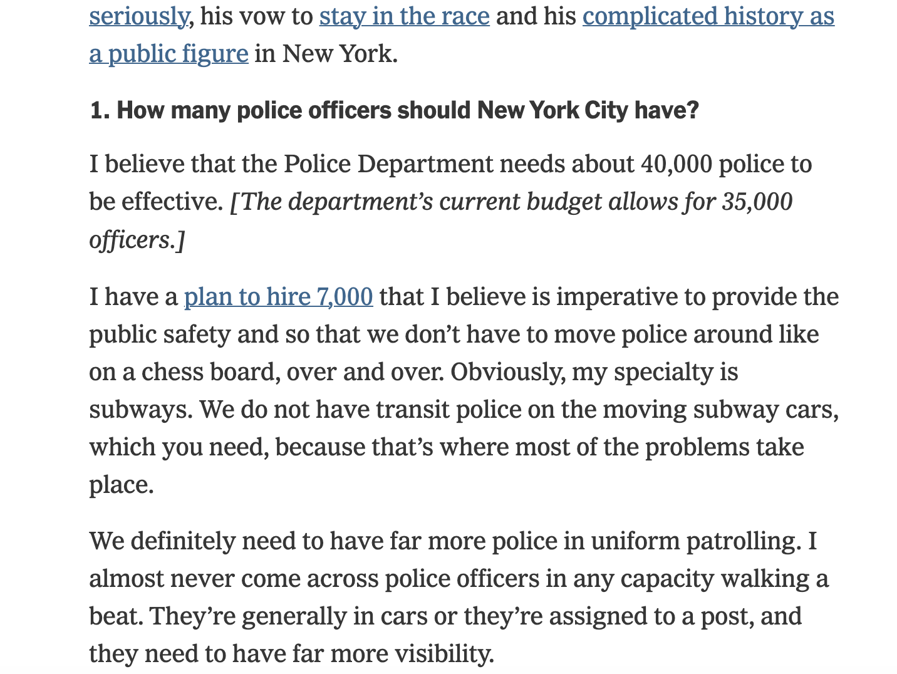
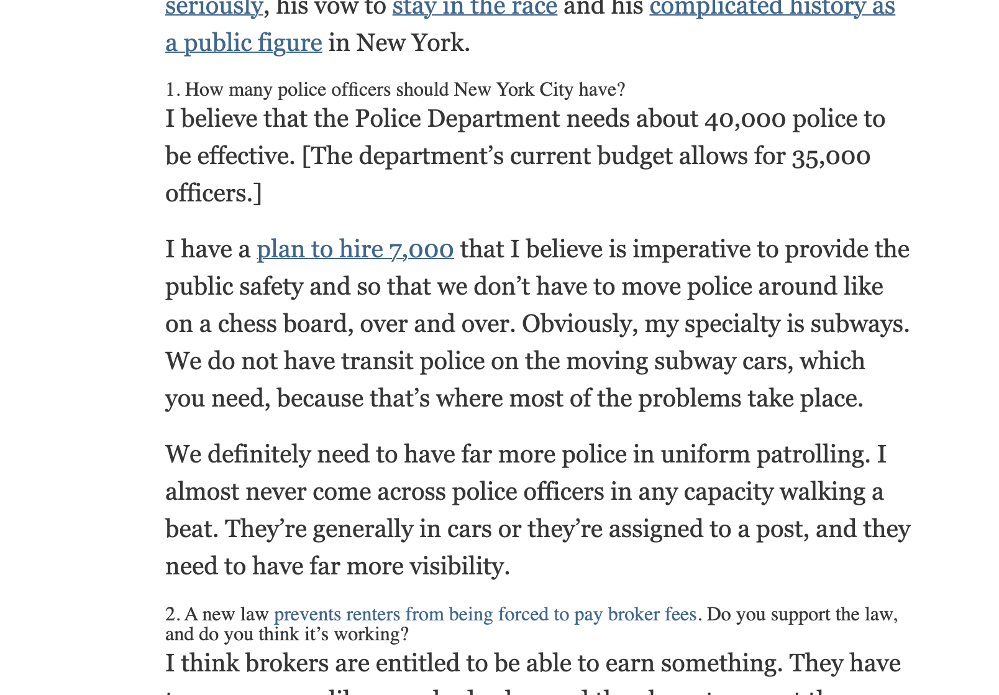
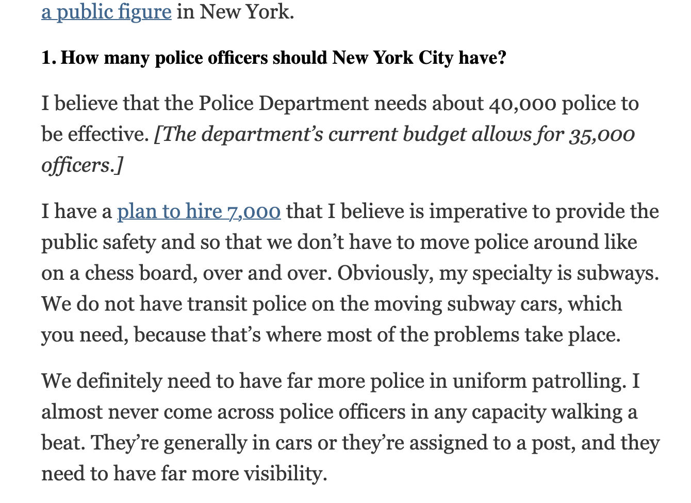

# HTML Project

I decided to reverse engineer a New York Times article because it is the website that I use most that uses static web pages.

Here is what the article looked like when I first downloaded the HTML:

And after changing the style sheets' "href" this is the fixed version:

